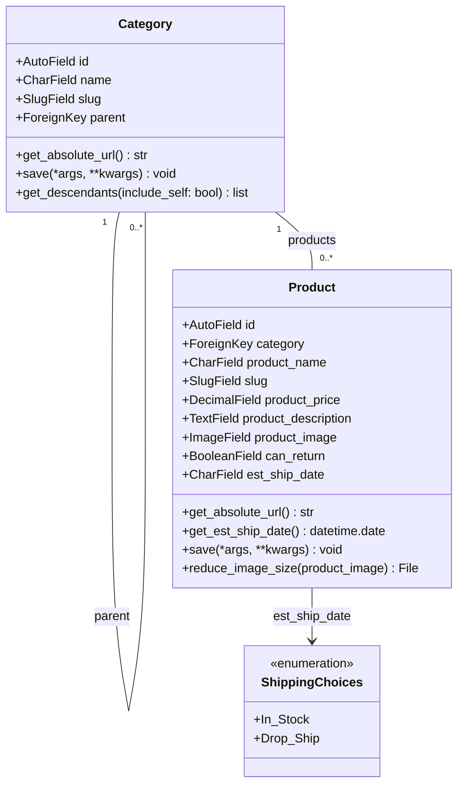
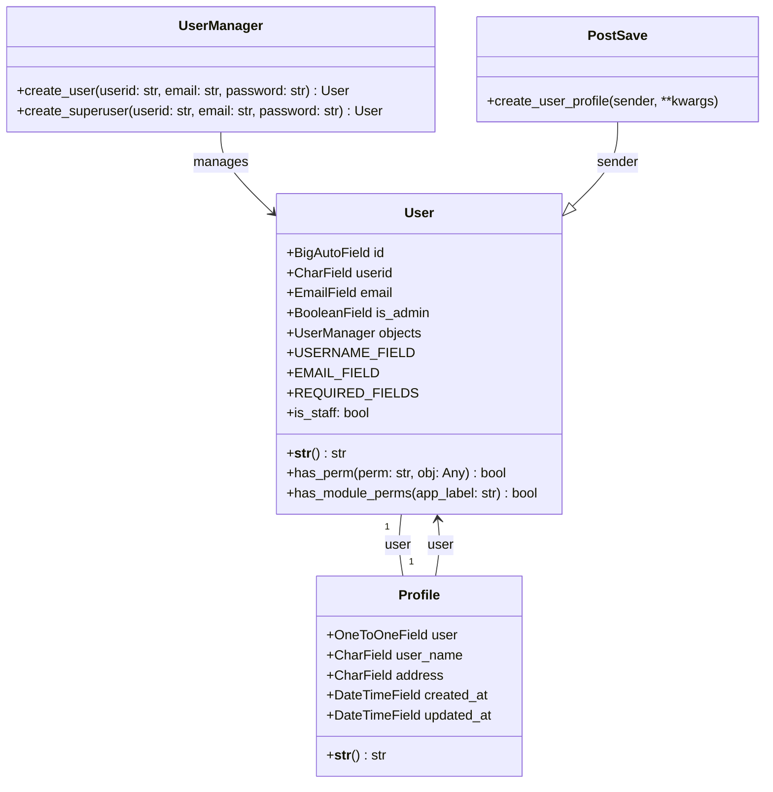

# Redpanda_shop Specification

## 実現したいこと
1. モデル作成
* Category Model
    - Category hierarchy level1>level2
    - カテゴリーVIEW
* User Model
    - USER  →　Profile(USERに紐づく配送先住所、お名前)
* Product model 
    - 商品 →　在庫：当日出荷表示 / 直送：本日から七日後出荷表示
    - カテゴリー登録は末端レベルで登録できるように
    - Imageはスケイル50で圧縮してアップロードされるように
2. AdminでUSER, 商品, カテゴリーのCRUDができるように
3. Cart In機能
4. 会員登録機能
5. ログイン・ログアウト
6. CHECK OUT(着払いでOK)
7. 検索
8. Chat機能


## WHY
1. Authenication
* Session vs. Token(JWT)

2. Page Load
* Ajax vs. Full page load
    - Cart 数量変更、商品ページView

## OTHER Wishlist
1. Breadcrumbs
2. SMTP
3. PW validation
4. Pay - stripe
5. Login - Firebase


## クラス図　- Product

## クラス図　- User


## django_session schema

| Column Name | Data Type | Constraints |
|---|---|---|
| session_key | VARCHAR(40) | PRIMARY KEY |
| session_data | TEXT | NOT NULL |
| expire_date | DATETIME | NOT NULL |

>session_data : serialized the cart item information


## Active virtual env & run server
```
source Scripts/activate
cd project
python manage.py runserver
```

## DB Migaration
```
python manage.py makemigrations
python manage.py migrate
```

## create app

`python manage.py startapp cart`


## ERROR LOG

* basic errors - URL route path error, models related, template error

* LogoutView class RETURN 405 Method Not Allowed -> POSTで解決

https://docs.djangoproject.com/en/5.0/releases/4.1/#log-out-via-get

https://qiita.com/guabanapple/items/c8062a138acbbb5896de

* Login Form passing error

>The default LoginView class in Django inherits from AuthenticationForm and accepts username and password as default fields.
>This version makes it clear that LoginView inherits from AuthenticationForm and specifies that it accepts username and password fields by default.

ということで、loginにemailがあったのでできなかった
```
class LoginView(RedirectURLMixin, FormView):

    form_class = AuthenticationForm
    authentication_form = None
    template_name = "registration/login.html"
    redirect_authenticated_user = False
    extra_context = None
```
```
class AuthenticationForm(forms.Form):
    """
    Base class for authenticating users. Extend this to get a form that accepts
    username/password logins.
    """
    username = forms.CharField(label=_("Username"), max_length=30)
    password = forms.CharField(label=_("Password"), widget=forms.PasswordInput)

```