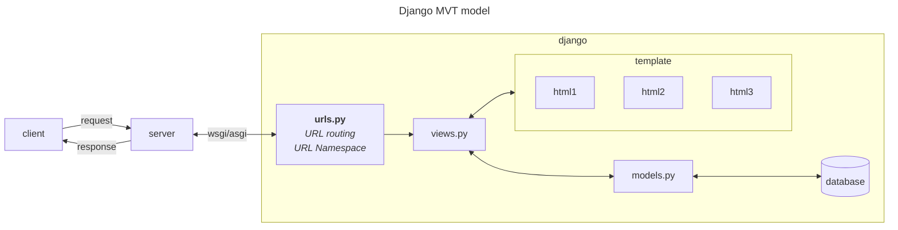
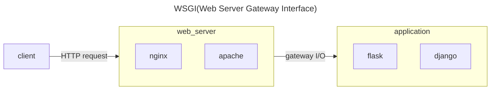

# Redpanda_shop

## Django structure




Direcotory structure


```tree
rendpanda_shop
├── config --> settings.py, urls.py, wsgi.py, asgi.py
├── static --> media
├── secrets --> yaml
├── cart --> app
└── store --> app
```


## Security

### Option1. Using django-environ

Install 

`pip install django-environ`


DIR
```tree
rendpanda_shop
├── config
    ├── settings.py
├── cart
├── secrets
    ├── .env.dev
    └── .env.prod
├── static
└── store
```


Setup

`settings.py`
```
import environ 
env = environ.Env()

BASE_DIR = Path(__file__).resolve().parent.parent
root = environ.Path(BASE_DIR / 'secrets')

#本番環境
# env.read_env(root('.env.prod'))

#開発環境
env.read_env(root('.env.dev'))

#SECRET_KEY取得
SECRET_KEY = env('SECRET_KEY')
```

### 2. Using Yaml

Install

`pip install pyyaml`


DIR
```tree
rendpanda_shop
├── config
    ├── settings.py
├── cart
├── secrets
    ├── .env.dev
    └── .env.prod
├── static
└── store
```


Setup

`settings.py`
```
import yaml #追記

BASE_DIR = Path(__file__).resolve().parent.parent #追記
def read_yaml_config(file_path): #追記
    with open(file_path, 'r') as file:
        return yaml.safe_load(file)
#本番環境
# config = read_yaml_config(BASE_DIR / 'secrets/prod.yml')

#開発環境
config = read_yaml_config(BASE_DIR / 'secrets/dev.yml')

SECRET_KEY = config.get('SECRET_KEY')
```

## DB Migration (CRUDのDB処理)


```
python manage.py makemigrations
python manage.py migrate
``` 
>`makemigrations`
>このコマンドはプロジェクト内のモデルの変更（追加、削除、変更）を検出し、それらの変更をデータベースのマイグレーションファイルとして保存します。マイグレーションファイルを保存するだけで、このコマンドだけではデータベースに反映はされません。

>`migrate`
>このコマンドは、makemigrationsで生成されたマイグレーションファイルを実際のデータベースに適用します。マイグレーションを実行すると、データベーススキーマが変更され、新しいモデルや変更がデータベースに反映されます。


> `db.sqlite3` file is created

## Run server

`python manage.py runserver`


active virtual env & run server
```
cd project
source Scripts/activate
python manage.py runserver
```


## Python server gateway interface

>Usage: WSGI is used for synchronous Python web >applications, where each request is handled one >at a time in a blocking manner.


# Notes
* web socket -wsgi asgi
* url name space - urls.py
* oop, instanciation
* Django의 ORM
* def __init__, __init__= name, 
* @admin.register(Category)
* super()
* gitignore


## Initial Steps

### 1.Start virtualenv
Initial setup
```
pip install virtualenv
virtualenv project
source Scripts/activate
```

### 2.Install django app

`pip install django`

### 3.Start project(config setup)

`django-admin startproject config`
```tree
config
├── asgi.py
├── wsgi.py
├── settings.py -->configs : timezone, lang, apps, DIR, etc
├── urls.py
├── views.py --> create for multiple app
└── manage.py
```
### 4.Create superuser(admin)

`python manage.py createsuperuser`

### 6.APP - Store

* Install

`python manage.py startapp store`

```tree
store
├── admin.py - Add models in admin page
├── apps.py
├── models.py -make models from DB
├── tests.py
├── urls.py
└── views.py
```

* Image handling
  - install image handler `pip install pillow`
  - create directory
```tree
├──config -->main configs
├──store
└── static
    └──media :product images uploaded #127.0.0.1:8000/media/images/BulletGuard-iPhone.jpg
```


### 7.APP - Cart


`python manage.py startapp cart`


